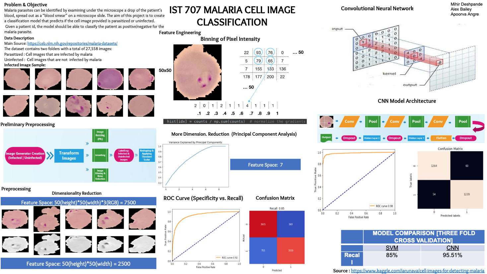

Project Overview: Train a SVM and CNN binary classifier on the malaria dataset https://ceb.nlm.nih.gov/repositories/malaria-datasets/
+ The CNN model, not surprisingly performed better than the SVM model
+ The Shiny app calls the sourced python Keras::model.predict() using the reticulate package and 
displays the classification result/image
+ Used this repo to understand pixel binning for SVM feature engineering: https://github.com/stefanfiott/malaria-detection-using-svm

